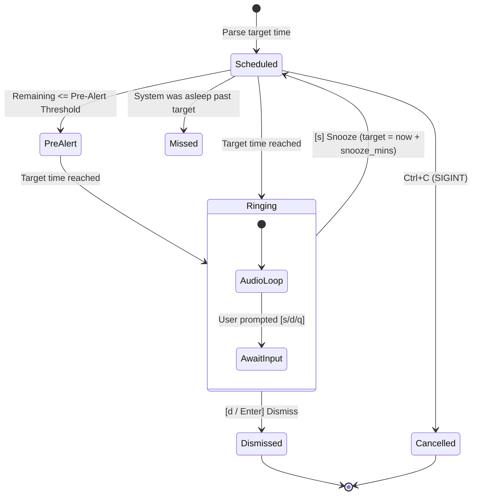

# Python CLI Alarm Clock

[](https://www.python.org/downloads/)
[]()
[-success.svg)]()
[]()

A resilient, drift-free, and intuitive Command Line Interface (CLI) alarm clock built with Python's standard library. Engineered with **zero external dependencies**, cross-platform audio fallbacks, dual-mode interaction (instant quick alarms vs. interactive wizards with strict validation), pre-alarm heads-up alerts, saved alarm presets, and standalone executable compilation.

---

## 📑 Table of Contents

- [Key Highlights](#-key-highlights)
- [Architecture & Design](#-architecture--design)
- [Installation & Running From Anywhere](#-installation--running-from-anywhere)
  - [Run Without Python (Standalone Executable)](#run-without-python-standalone-executable)
  - [Install Globally (Run as `alarm` Command)](#install-globally-run-as-alarm-command)
  - [Windows Batch Launcher (`alarm.bat`)](#windows-batch-launcher-alarmbat)
- [Feature Demonstration Suite (`demo.py`)](#-feature-demonstration-suite-demopy)
- [Usage Examples](#-usage-examples)
  - [1. Quick Alarms (Instant Mode)](#1-quick-alarms-instant-mode)
  - [2. Interactive Setup Wizard (With Validation)](#2-interactive-setup-wizard-with-validation)
  - [3. Pre-Alarm Heads-up Warning](#3-pre-alarm-heads-up-warning)
  - [4. Custom Audio Files & Slicing](#4-custom-audio-files--slicing)
  - [5. Preset Management](#5-preset-management)
- [Audio Engine & Patterns](#-audio-engine--patterns)
- [Technical Deep Dive: Sleep Mode & OS Realities](#-technical-deep-dive-sleep-mode--os-realities)
- [Running Automated Tests](#-running-automated-tests)
- [Project Layout](#-project-layout)

---

## 🌟 Key Highlights

1. **Zero External Dependencies:** No `pip install` required. Clone and run immediately on any system with Python 3.8+.
2. **Drift-Free Timing:** Calculates absolute wall-clock target deltas `(target - now)` instead of accumulating latency with naive `time.sleep()`.
3. **Dual-Mode UX:**
   - **Quick Mode:** `python main.py 15m` starts an alarm in 1 second.
   - **Interactive Mode:** `python main.py` or `-i` provides a guided numbered terminal wizard.
4. **Interactive Ringing & Non-Blocking Audio:** Audio loops on a daemon thread while user controls (`[s]` Snooze, `[d]` Dismiss, `[q]` Quit) remain immediately responsive.
5. **Pre-Alarm Heads-Up:** Emits a gentle tone and status banner before the main alarm (e.g. `--pre-alert 2m`).
6. **Smart Rollover:** Automatically advances times that have already passed today to tomorrow morning.
7. **Custom Sound Slicing & Validation:** Supports custom `.wav` tracks with bounds-checking and duration clamping.

---

## 🏗 Architecture & Design

The application follows a clean separation of concerns:

```
┌────────────────────────────────────────────────────────┐
│                        main.py                         │
│            (CLI Entry, Signals & Routing)              │
└───────────────┬────────────────────────┬───────────────┘
                │                        │
       ┌────────▼────────┐      ┌────────▼────────┐
       │   cli/parser    │      │  presets.py     │
       │  (Time Parsing) │      │ (JSON Storage)  │
       └────────┬────────┘      └─────────────────┘
                │
       ┌────────▼────────┐
       │   engine.py     │◄────────────┐
       │  (State Machine │             │
       │  & Drift-Free)  │             │
       └────────┬────────┘             │
                │                      │
       ┌────────▼────────┐      ┌──────┴──────────┐
       │  controller.py  │──────►   sound.py      │
       │ (Threading & UI)│      │ (Winsound/Bell) │
       └────────┬────────┘      └─────────────────┘
                │
       ┌────────▼────────┐
       │      ui.py      │
       │ (In-Place \r)   │
       └─────────────────┘
```

### State Machine Lifecycle



---

## 🚀 Installation & Running From Anywhere

### 1. Standard Run (Python 3.8+)
Clone the repository and run directly without any dependencies:
```bash
git clone https://github.com/saijyothikumar/PythonCLIAlarm.git
cd PythonCLIAlarm
python main.py 10m
```

### 2. Run Without Python (Standalone Executable)
Can this run on a machine **without Python installed**? **Yes!**  
Using our included `build_standalone.py` script, you can package the entire application and CPython runtime into a standalone single-file binary (`alarm.exe` on Windows, or `alarm` on Linux/macOS):

```bash
# Optional: Install PyInstaller if not present
pip install pyinstaller

# Build single-file executable
python build_standalone.py
```
* The output is placed in `dist/alarm.exe` (or `dist/alarm`).
* This binary can be copied to **any** computer and run directly without needing Python or any runtime installed!

### 3. Install Globally (Run `alarm` Command from Any Directory)
To invoke `alarm` from any directory in your terminal:
```bash
pip install -e .
```
Now run from anywhere:
```bash
alarm 15m -m "Tea Break"
alarm save standup 09:30 -p digital
```

### 4. Windows Direct Launcher (`alarm.bat`)
For Windows environments without global pip installation, the included `alarm.bat` wrapper enables direct execution:
```cmd
alarm 10m
alarm --help
```

---

## 🎮 Feature Demonstration Suite (`demo.py`)

We provide a comprehensive interactive demonstration hub to inspect and evaluate all system capabilities:

```bash
python demo.py
```
```text
============================================================
          Python CLI Alarm - Feature Demonstration Hub      
============================================================
  [1] 5-Second Live Countdown & Pre-Alert
  [2] Preset Management Lifecycle
  [3] Built-in Sound Pattern Showcase
  [4] Human-Friendly Time Parsing Showcase
  [5] Error Handling & Bounds Checking
  [6] Run All Demonstrations Sequentially
  [7] Exit
------------------------------------------------------------
```
* Run a specific demo directly: `python demo.py 1`
* Run the entire suite sequentially: `python demo.py --all`

---

## 💡 Usage Examples

### 1. Quick Alarms (Instant Mode)

```bash
# 10-minute timer
python main.py 10m

# 45-second timer with custom label
python main.py 45s -m "Tea Steeped"

# Clock time (24-hour format)
python main.py 14:30 -m "Team Sync"

# Clock time (12-hour AM/PM format, auto-rolls to tomorrow if time has passed)
python main.py 7:30am -m "Wake Up"
```

### 2. Interactive Setup Wizard (With Strict Validation)

Run without arguments or with `--interactive`:

```bash
python main.py
```
```text
============================================================
              ⏰ Interactive Alarm Setup Wizard              
============================================================
  [1] Set Quick Timer (e.g., 10m, 25m Pomodoro, 45s)
  [2] Set Clock Alarm (e.g., 7:30am, 14:45, noon)
  [3] Run a Saved Preset
  [4] Sound Preview & Audio Diagnostics
  [5] Exit
------------------------------------------------------------
Select an option (1-5) [1]:
```

* **Validation & Error Recovery:**
  - If an invalid menu number is entered (e.g. `6`), it alerts the user and prompts again instead of crashing.
  - Typo protection: entering an invalid sound pattern like `'pusle'` prompts the user to select from `[1-4]` or valid names.
  - Out-of-bounds guards: pre-alert durations longer than the total alarm time or non-positive snooze minutes are caught immediately.

### 3. Pre-Alarm Heads-up Warning

Receive a gentle heads-up banner and single chime 2 minutes before the main alarm rings:

```bash
python main.py 25m -m "Pomodoro" --pre-alert 2m
```

### 4. Custom Audio Files & Slicing

Use a custom audio track with duration limits and bounds checking:

```bash
python main.py 10m --sound sample.wav --sound-duration 30s
```

* **Error Handling:** If the audio file does not exist, or if the requested duration exceeds the audio length, the CLI provides clear diagnostic feedback rather than crashing.

### 5. Preset Management

Save and run frequently used alarms:

```bash
# Save a preset
python main.py save standup 09:30 -m "Team Sync" --pattern digital --snooze 5

# List all saved presets
python main.py list

# Run a preset
python main.py run standup

# Delete a preset
python main.py delete standup
```

---

## 🔊 Audio Engine & Patterns

The built-in sound engine requires **no third-party dependencies**:

| Pattern | Description | Frequency Profile |
| :--- | :--- | :--- |
| `chime` *(default)* | Musical ascending triad | 523Hz (C5) → 659Hz (E5) → 784Hz (G5) → 1046Hz (C6) |
| `digital` | Classic digital alarm clock | Double-beep burst (850Hz) |
| `pulse` | High-urgency alert | Rapid pulsating bursts (1200Hz) |
| `bell` | Universal fallback | Standard ASCII bell (`\a`) |

Test and verify your speaker output:

```bash
# Test default sound
python main.py --test-sound

# Preview specific pattern
python main.py --preview pulse
```

---

## 🔬 Technical Deep Dive: Sleep Mode & OS Realities

During our architectural research, we evaluated hardware sleep states:

1. **CPU Sleep Suspends Processes:** When a laptop enters S3 Sleep or Modern Standby, CPU execution for user-space threads is paused.
2. **ACPI Wake Timers:** Waking hardware requires OS-specific administrative privileges (`SetWaitableTimer` with resume flag on Windows, `rtcwake` on Linux).
3. **Lock-Screen Security Isolation:** Modern OSs isolate the lock screen (Windows Secure Desktop) to prevent unauthenticated keystroke interception.

### Our Solution: Sleep Detection & Auto-Silence
- **Missed Alarm Catch-up:** When the system wakes up, the scheduler detects if wall-clock time jumped past the target time, immediately firing a highlighted `[MISSED ALARM]` alert.
- **Auto-Silence Safety:** The alarm ringer will loop for a maximum safety timeout (60s) before auto-snoozing to prevent draining laptop battery while unattended.

---

## 🧪 Running Automated Tests

Run the full automated test suite (30 tests covering parser, engine, presets, interactive wizard error recovery, and CLI integration):

```bash
python -m unittest discover tests
```

Output:
```text
Ran 30 tests in 2.723s
OK
```

---

## 📁 Project Layout

```
PythonCLIAlarm/
├── .gitignore
├── AGENT_RULES.md          # Engineering standards & guidelines
├── README.md               # Production documentation
├── REQUIREMENTS.md         # Detailed system requirements
├── RESEARCH.md             # Technical feasibility & OS sleep deep dive
├── ROADMAP.md              # 14-phase commit history and validation gates
├── alarm.bat               # Windows batch launcher (runs alarm directly)
├── build_standalone.py     # Packages standalone single-file alarm.exe
├── demo.py                 # Comprehensive interactive demonstration hub
├── main.py                 # Root CLI entry point
├── pyproject.toml          # Standard packaging & global CLI command spec
├── src/
│   └── alarm_clock/
│       ├── __init__.py
│       ├── cli.py          # Argparse parser, subcommands, help
│       ├── controller.py   # Multi-threaded ringer & snooze loop
│       ├── engine.py       # Drift-free scheduler & state machine
│       ├── main.py         # Main dispatch & signal handling
│       ├── parser.py       # Human time & duration parsing
│       ├── presets.py      # JSON preset storage manager
│       ├── sound.py        # Cross-platform sound engine
│       ├── ui.py           # Terminal UI, \r ticker & ANSI formatting
│       └── wizard.py       # Interactive setup wizard with strict validation
└── tests/
    ├── test_engine.py      # Scheduler & pre-alert tests
    ├── test_integration.py # End-to-end CLI integration tests
    ├── test_parser.py      # Time and duration parser tests
    ├── test_presets.py     # Preset save/load tests
    └── test_wizard.py      # Interactive wizard validation & typo tests
```

---

## 📄 License

MIT License. Designed and engineered for clean, reliable command-line productivity.
