# Phased Implementation Roadmap & Git Commit Strategy

**Project:** Python CLI Alarm Clock  
**Development Strategy:** Incremental, Test-Driven Commits with Strict Validation Gates  

---

## Phase Breakdown & Commit Sequence

```mermaid
graph TD
    P1[Phase 1: Research & Specifications] --> P2[Phase 2: Project Architecture & Time Parser]
    P2 --> P3[Phase 3: Comprehensive Parser Test Suite]
    P3 --> P4[Phase 4: Cross-Platform Sound Engine]
    P4 --> P5[Phase 5: Sound Profiles & Test-Sound CLI]
    P5 --> P6[Phase 6: Drift-Free Core Clock & Sleep Detection]
    P6 --> P7[Phase 7: Live Dynamic Terminal Countdown UI]
    P7 --> P8[Phase 8: Multi-Threaded Ringer & Snooze Controller]
    P8 --> P9[Phase 9: Pre-Alarm Heads-up Notification]
    P9 --> P10[Phase 10: Preset Storage & Management Subcommands]
    P10 --> P11[Phase 11: Interactive Setup Wizard]
    P11 --> P12[Phase 12: Signal Handling & Terminal Cleanliness]
    P12 --> P13[Phase 13: End-to-End & Integration Test Suite]
    P13 --> P14[Phase 14: Comprehensive README & Demo Suite]
    P14 --> P15[Phase 15: Subcommand Routing & Dispatch Hardening]
    P15 --> P16[Phase 16: Wizard Input Validation & Standalone Binary]
    P16 --> P17[Phase 17: Multi-OS GitHub Actions CI & Pyalarm Alias]
    P17 --> P18[Phase 18: Import Sanitization & Demo Runner Hardening]
    P18 --> P19[Phase 19: Setuptools Discovery & Cross-Platform Packaging]
```

---

## Detailed Stages & Commit Plan

### Commit 1: `docs: initialize research, feasibility analysis, and system requirements`
* **Artifacts:** `RESEARCH.md`, `REQUIREMENTS.md`, `ROADMAP.md`, `AGENT_RULES.md`
* **Scope:** Architectural feasibility, competitive review, trade-off matrix, and functional specifications.
* **Validation:** Peer review and requirement alignment.

---

### Commit 2: `feat(parser): implement robust human-time and duration parsing`
* **Artifacts:** `src/alarm_clock/parser.py`
* **Scope:**
  - Parsing relative durations: `10s`, `15m`, `1h`, `1h30m`.
  - Parsing absolute 24h (`14:30`, `07:15`) and 12h formats (`7:30am`, `7pm`).
  - Next-day rollover logic (if target time has elapsed today, advance to tomorrow).
* **Validation:** Scripted parser dry-run checks.

---

### Commit 3: `test(parser): add comprehensive unit tests for time parsing and edge cases`
* **Artifacts:** `tests/test_parser.py`
* **Scope:** Unit tests covering midnight (`00:00`), midday (`12:00pm`), tomorrow rollovers, compound durations (`1h 15m 30s`), and invalid format exceptions.
* **Validation:** Run unit tests (`python -m unittest tests/test_parser.py`). All tests pass.

---

### Commit 4: `feat(sound): implement zero-dependency cross-platform sound engine`
* **Artifacts:** `src/alarm_clock/sound.py`
* **Scope:**
  - Standard-library sound abstraction: Windows (`winsound`), macOS (`afplay`), Linux (`aplay`/`paplay`), universal fallback (`\a` + ANSI visual flash).
  - Built-in sound patterns: `chime`, `digital`, `pulse`, `bell`.
  - Custom audio file playback (`.wav`).
* **Validation:** Audio loop playback test across operating system layers.

---

### Commit 5: `feat(cli): add sound preview and audio diagnostic flag`
* **Artifacts:** `src/alarm_clock/cli.py`, `src/alarm_clock/sound.py`
* **Scope:** `--test-sound` and `--preview <pattern>` CLI flags allowing users to verify speaker volume and sound patterns before scheduling alarms.
* **Validation:** Run `python -m src.alarm_clock.cli --test-sound --pattern digital`.

---

### Commit 6: `feat(engine): build drift-free clock scheduler with sleep detection`
* **Artifacts:** `src/alarm_clock/engine.py`
* **Scope:**
  - Adaptive sleep loop calculating real wall-clock delta `(target - now)`.
  - Sleep/wake-up detection: identifies system sleep gaps and alerts if an alarm was missed during suspension.
* **Validation:** Simulated clock jump test to verify immediate triggering on wake-up.

---

### Commit 7: `feat(ui): implement dynamic in-place terminal countdown ticker`
* **Artifacts:** `src/alarm_clock/ui.py`
* **Scope:**
  - Clean `\r` line rewrites with formatted countdown `[00:14:22 remaining]  Target: 07:30:00 AM  • Standup`.
  - Terminal cursor management (`\033[?25l` to hide, `\033[?25h` to restore).
  - Visual color highlights for active, pre-alert, and ringing states.
* **Validation:** Visual terminal verification of real-time seconds ticking without screen tearing.

---

### Commit 8: `feat(controller): implement multi-threaded ringer with interactive snooze and dismiss`
* **Artifacts:** `src/alarm_clock/controller.py`
* **Scope:**
  - Non-blocking audio playback on daemon thread controlled by `threading.Event`.
  - Concurrent user key prompt: `[s]` to snooze (resets target by N minutes), `[d]/[Enter]` to dismiss, `[q]` to quit.
  - Auto-silence safety timeout after 60s.
* **Validation:** Trigger mock alarm, test snooze cycle (resumes countdown) and clean dismiss.

---

### Commit 9: `feat(alert): add pre-alarm heads-up notification option`
* **Artifacts:** `src/alarm_clock/engine.py`, `src/alarm_clock/ui.py`
* **Scope:**
  - `--pre-alert <duration>` (e.g. `2m`, `30s`).
  - Triggers a soft single chime and warning banner 2 minutes before the main alarm.
* **Validation:** Schedule a 1-minute alarm with `--pre-alert 30s` and verify two-stage alerting.

---

### Commit 10: `feat(presets): add persistent alarm presets and management commands`
* **Artifacts:** `src/alarm_clock/presets.py`
* **Scope:**
  - JSON-based preset storage (`alarms.json`).
  - Subcommands: `save <name>`, `list`, `run <name>`, `delete <name>`.
* **Validation:** Save preset `tea 10m`, list presets, and trigger via `alarm run tea`.

---

### Commit 11: `feat(wizard): add interactive configuration wizard for setup without flags`
* **Artifacts:** `src/alarm_clock/wizard.py`
* **Scope:**
  - Step-by-step interactive CLI prompt when launched with no arguments or `--interactive`.
  - Allows selecting quick timer, setting alarm, browsing presets, or customizing sounds.
* **Validation:** Run without arguments and walk through interactive setup prompts.

---

### Commit 12: `fix(signals): handle SIGINT gracefully and clean up terminal state`
* **Artifacts:** `src/alarm_clock/main.py`
* **Scope:**
  - Intercept `Ctrl+C` (`SIGINT`) to suppress Python stack trace and restore cursor.
  - Safe terminal teardown on unhandled exceptions.
  - Edge case bug fixes: negative duration handling, invalid time formats.
* **Validation:** Send `Ctrl+C` at various stages (countdown, wizard, ringing) and verify clean exit.

---

### Commit 13: `test: add end-to-end and integration test suite`
* **Artifacts:** `tests/test_engine.py`, `tests/test_presets.py`
* **Scope:** Automated test coverage for scheduler states, preset save/load cycles, and CLI option parsing.
* **Validation:** Run full test suite: `python -m unittest discover tests`.

---

### Commit 14: `docs: add comprehensive README with architecture, quickstart, and demo script`
* **Artifacts:** `README.md`, `demo.py`
* **Scope:**
  - Engineering architecture diagrams.
  - CLI usage examples (Quick mode, Wizard mode, Presets, Flags).
  - Senior design decisions and rationale.
  - Self-contained demo script for fast evaluator review.
* **Validation:** Verification of all documented commands against working code.

---

### Commit 15: `fix(cli): refine subcommand routing and argument dispatching`
* **Artifacts:** `src/alarm_clock/cli.py`, `src/alarm_clock/main.py`
* **Scope:**
  - Fixed conflict between positional target time and subcommands (`save`, `run`, `list`, `delete`).
  - Implemented dynamic subparser dispatching based on leading argument inspection.
* **Validation:** Verified both positional alarms (`alarm 10m`) and subcommands (`alarm list`) parse correctly.

---

### Commit 16: `fix(validation): harden wizard and CLI input validation with recovery loops and standalone support`
* **Artifacts:** `src/alarm_clock/wizard.py`, `build_standalone.py`, `alarm.bat`, `pyproject.toml`, `tests/test_wizard.py`
* **Scope:**
  - Strict input validation loops for wizard menus (rejecting out-of-bounds options like `6`).
  - Strict sound pattern validation (rejecting typos like `pusle` with helpful re-prompting).
  - Snooze and pre-alert duration boundary enforcement.
  - PyInstaller standalone binary builder (`build_standalone.py`) and Windows launcher (`alarm.bat`).
* **Validation:** Expanded test suite with 4 new tests in `test_wizard.py`. Total test count: 30 passed.

---

### Commit 17: `ci: add multi-os and multi-python GitHub Actions workflow and pyalarm alias`
* **Artifacts:** `.github/workflows/ci.yml`, `pyproject.toml`, `README.md`
* **Scope:**
  - Continuous integration matrix across **Ubuntu, macOS, and Windows** on Python **3.8, 3.9, 3.10, 3.11, and 3.12**.
  - Added collision-proof `pyalarm` CLI entry point alongside `alarm`.
* **Validation:** GitHub Actions pipeline configuration and badge integration.

---

### Commit 18: `refactor: eliminate unused imports, harden demo error checks, and configure gitignore`
* **Artifacts:** `demo.py`, `.gitignore`, `src/alarm_clock/`, `tests/`
* **Scope:**
  - Audited and eliminated all unused imports across all modules using Python AST parsing.
  - Replaced raw assertions in demo runner with clean exit-code validation.
  - Configured `.gitignore` to prevent personal notes or teleprompter scripts from leaking into git.
* **Validation:** Automated AST audit confirmed zero unused imports across the entire repository.

---

### Commit 19: `fix(packaging): correct setuptools package discovery, entry points, and relative imports for CI`
* **Artifacts:** `pyproject.toml`, `src/alarm_clock/`
* **Scope:**
  - Configured standard `src` layout package discovery in `pyproject.toml` (`where = ["src"]`).
  - Converted internal imports to PEP 328 package-relative imports (`from .xxx import ...`).
  - Corrected entry point target to `alarm_clock.main:main`.
* **Validation:** Verified `pip install -e .` and execution of `alarm --help` and `pyalarm --help` locally and across all 15 matrix jobs on GitHub Actions.

